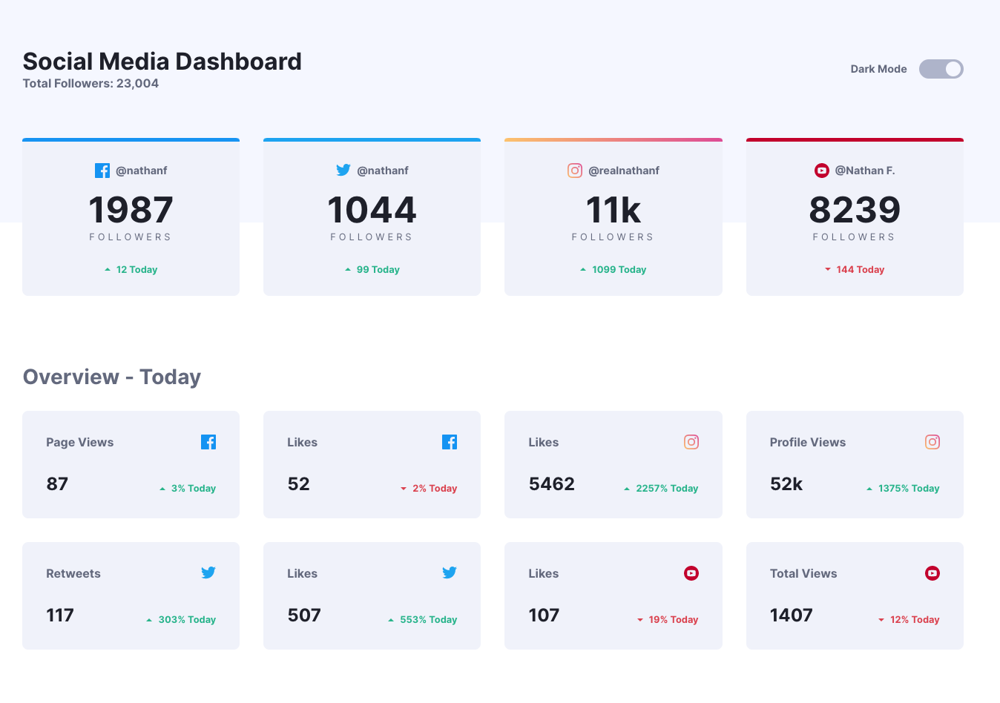

# Frontend Mentor - Social media dashboard with theme switcher solution

This is a solution to the [Social media dashboard with theme switcher challenge on Frontend Mentor](https://www.frontendmentor.io/challenges/social-media-dashboard-with-theme-switcher-6oY8ozp_H). Frontend Mentor challenges help you improve your coding skills by building realistic projects. 

## Table of contents

- [Overview](#overview)
  - [The challenge](#the-challenge)
  - [Screenshot](#screenshot)
  - [Links](#links)
- [My process](#my-process)
  - [Built with](#built-with)
- [Author](#author)

## Overview

### The challenge

Users should be able to:
- View the optimal layout for the site depending on their device's screen size
- See hover states for all interactive elements on the page
- Toggle color theme to their preference

### Screenshot

Given promt:

Preview of end result:

### Links

- Vercel: [https://social-media-dashboard-nine-alpha.vercel.app/](https://social-media-dashboard-nine-alpha.vercel.app/)

## My Process

### Built with

- Semantic HTML5 markup
- CSS custom properties
- Flexbox
- CSS Grid
- SCSS
- Mobile-first workflow
- [React](https://reactjs.org/) - JS library

## Author

- Website - [Karlie Watts](https://www.karliewatts.com)
- Frontend Mentor - [@karliewatts](https://www.frontendmentor.io/profile/karliewatts)

